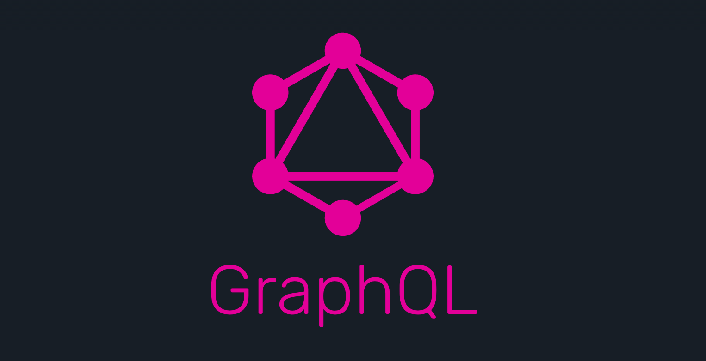
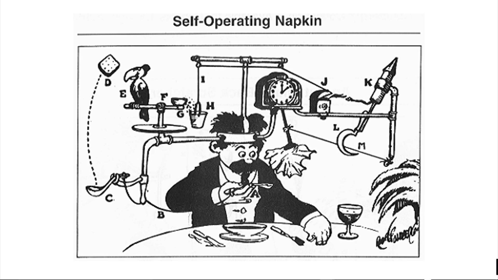
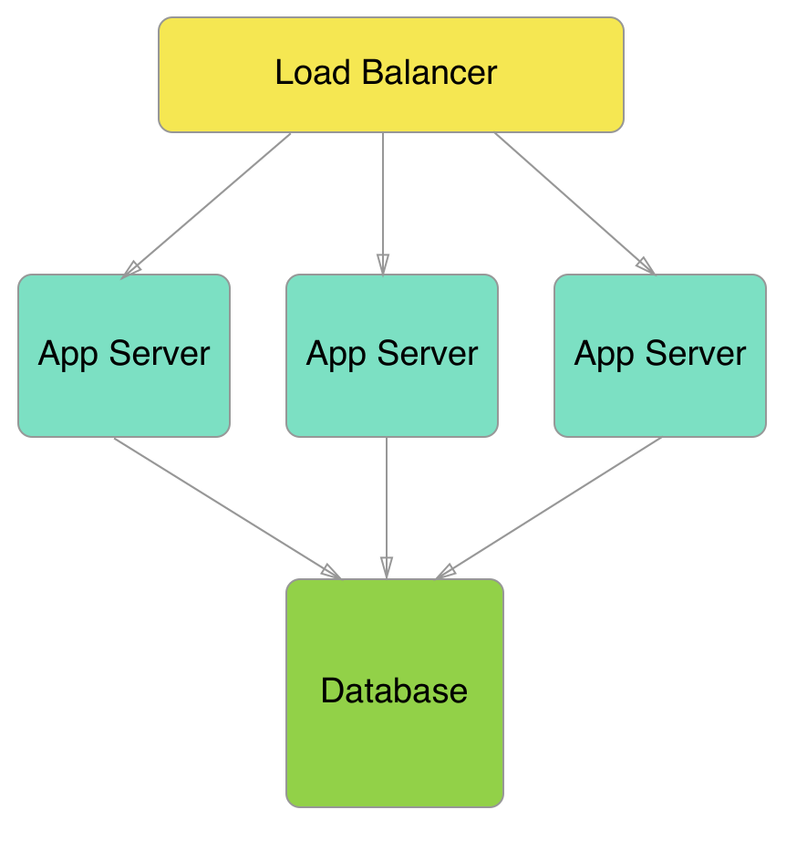

theme: Poster, 1

# GraphQL Subscriptions

# For _**realtime**_ apps



---

### *Wifi:* foo
### *Password:* foo123

^ there'll be a demo later in this talk. If everyone can get on the guest wifi in advance that would be sweet.

---

## GraphQL
## Subscriptions Are
#[fit] _**Awesome**_

---

## But first some
#[fit] background


---

## Before GraphQL was
#[fit] *REST*

---


#[fit] *Re*presentational
#[fit] *S*tate
#[fit] *T*ransfer

*Roy Fielding* invented it for his PhD thesis in 2000

^ not a fun guy

---


#[fit] Not to
#[fit] be confused
#[fit] with this guy

*Noel Fielding:* surreal comedian

^ a fun guy

---


#[fit] REST has no story for
#[fit] *live data*

---

#[fit] *Content-Type*?

---

#[fit] Does *JSONAPI* have an
#[fit] answer for live data?

---


^ um, nope

---

## Must step
#[fit] *outside*
## of REST

---


---



#[fit] _Bespoke_
#[fit] _solutions_

^ Home grown long polling
^ Websockets
^ framework friction
^ miss out on tooling

---

#[fit] The *Anatomy*
## of a GraphQL Subscription

^ The concepts are general, examples are provided using Apollo Client, React, Elixir, Absinthe, Phoenix and Postgres

---

# *1.* The syntax

---

## *Specifies*

### what to subscribe to
### what to return when triggered

---

# Syntax Example

```
subscription {
  personCreated {
    name
    bio
    avatarUrl
    githubUsername
    location
  }
}
```

---

# Syntax Example

``` [.highlight: 1]
subscription {
  personCreated {
    name
    bio
    avatarUrl
    githubUsername
    location
  }
}
```

^ Tells the server that you want a subscription
^ The remainder is looks like a regular GraphQL query

---

# Syntax Example

``` [.highlight: 2]
subscription {
  personCreated {
    name
    bio
    avatarUrl
    githubUsername
    location
  }
}
```

^ This is the field that you're interested in receiving updates for.
^ It doesn't have to be named like an event
^ It can also accept arguments like any GraphQL field, e.g. person(name: "@freshtonic")

---

# Syntax Example

``` [.highlight: 3-7]
subscription {
  personCreated {
    name
    bio
    avatarUrl
    githubUsername
    location
  }
}
```

^ These are the fields that will be returned when the subscription is triggered.

---

# *2.* The GraphQL schema

---

## *Specifies*

### what can be subscribed to

---

# Schema example

```elixir
defmodule FaceQL.Web.Schema do
  use Absinthe.Schema

  # ✂ other parts of schema snipped 

  subscription do
    field :person_created, :person do
      config fn (_, _) -> {:ok, topic: "*"} end
    end
  end
end
```

---

# Schema example

```elixir, [.highlight: 6]
defmodule FaceQL.Web.Schema do
  use Absinthe.Schema

  # ✂ other parts of schema snipped 

  subscription do
    field :person_created, :person do
      config fn (_, _) -> {:ok, topic: "*"} end
    end
  end
end
```

^ declares a subscription

---

# Schema example

```elixir, [.highlight: 7]
defmodule FaceQL.Web.Schema do
  use Absinthe.Schema

  # ✂ other parts of schema snipped 

  subscription do
    field :person_created, :person do
      config fn (_, _) -> {:ok, topic: "*"} end
    end
  end
end
```

^ the name of the subscription. In this case "person_created".
^ and the type of the value that is returned (assume that's elsewhere in the schema)

---

# Schema example

```elixir, [.highlight: 8]
defmodule FaceQL.Web.Schema do
  use Absinthe.Schema

  # ✂ other parts of schema snipped 

  subscription do
    field :person_created, :person do
      config fn (_, _) -> {:ok, topic: "*"} end
    end
  end
end
```

^ configures the subscription. This is the name of the Phoenix channel topic that the subscription will publish to

---

# *3.* The trigger


---

The *triggering* mechanism
is specific to your server side 
GraphQL *implementation*

^ Absinthe, graphql.js, Sangria etc

---

# Trigger example *#1*

```elixir
defmodule FaceQL.Web.Schema do
  use Absinthe.Schema

  # ✂ other parts of schema snipped 

  mutation do
    field :create_person, type: :person do
      # ✂ snip
    end
  end

  subscription do
    field :person_created, :person do
      config fn (_, _) -> {:ok, topic: "*"} end

      trigger :create_person, topic: fn _ -> "*" end
    end
  end
end
```

^ this example uses Absinthe's built-in support for matching a mutation with a coresponding subscription trigger by name

---

# Trigger example *#1*

```elixir, [.highlight: 7, 16]
defmodule FaceQL.Web.Schema do
  use Absinthe.Schema

  # ✂ other parts of schema snipped 

  mutation do
    field :create_person, type: :person do
      # ✂ snip
    end
  end

  subscription do
    field :person_created, :person do
      config fn (_, _) -> {:ok, topic: "*"} end

      trigger :create_person, topic: fn _ -> "*" end
    end
  end
end
```

^ this is the easy way, but is not applicable in all situations.
^ specifically this only supports triggering subscriptions via GraphQL mutations.
^ not every use case for subscriptions will be triggered via mutations.
^ for example, when you have a read-only API
^ or when you have multiple servers behind a load balancer

---

# Trigger example *#2*

This is the *general* solution. Publish explicitly to fire a subscription.

```elixir
Absinthe.Subscription.publish(FaceQL.Web.Endpoint, person, topic: "*")
```

---

# *Considerations*



- Multiple servers behind a load balancer
- Subscriptions must be fired on *every* connected server!

### *Many options*

- Redis PubSub
- Postgres *`LISTEN`*/*`NOTIFY`*
- Horizontal app server gossip

---

# *4.* Binding to the UI


^ This will be Apollo Client & React specific with Phoenix channels as the transport

---

# Apollo Client boilerplate

*Import all the things!*

```javascript
import { ApolloProvider } from "react-apollo"
import { ApolloClient } from "apollo-client"
import { ApolloLink } from "apollo-link"
import { HttpLink } from "apollo-link-http"
import { InMemoryCache } from "apollo-cache-inmemory"

import * as AbsintheSocket from "@absinthe/socket"
import { createAbsintheSocketLink } from "@absinthe/socket-apollo-link"
import { Socket as PhoenixSocket } from "phoenix"
import { hasSubscription } from "@jumpn/utils-graphql"
```

^ Our demo is using regular HTTP and Websockets, hence lots of imports
^ Worth mentioning that this is still in flux and various blog posts contain conflicting information

---

# Apollo Client boilerplate

*Instantiate Apollo Client*

```javascript
const httpLink = new HttpLink({
  uri: "http://localhost:4000/api/graphql",
})

const socketLink = createAbsintheSocketLink(
  AbsintheSocket.create(new PhoenixSocket("ws://localhost:4000/socket"))
)

const hybridLink = new ApolloLink.split(
  operation => hasSubscription(operation.query),
  socketLink,
  httpLink
)

const client = new ApolloClient({
  link: hybridLink,
  cache: new InMemoryCache(),
})
```

---

# Apollo Client boilerplate

*Render the main App component*

```javascript
ReactDOM.render(
  <ApolloProvider client={client}>
    <App />
  </ApolloProvider>,
  document.getElementById("root")
)
```


---

# Binding to queries & subscriptions

```javascript
import PersonListWithPeople from "./person-list-with-people"
import { graphql } from "react-apollo"
import gql from "graphql-tag"

export const queryDocument = gql`
  {
    people {
      id
      githubUsername
    }
  }
`

export const subscriptionDocument = gql`
  subscription {
    personCreated {
      id
      githubUsername
    }
  }
`
```

---

# Binding to queries & subscriptions

## The container

```javascript
const withData = graphql(queryDocument, {
  props: props => {
    const subscribeToNewPeople = () =>
      props.data.subscribeToMore({
        document: subscriptionDocument,
        updateQuery: (prevPeople, { subscriptionData }) => ({
          people: [subscriptionData.data.personCreated, ...prevPeople.people],
        }),
      })

    return { ...props, subscribeToNewPeople }
  },
})

export default withData(PersonListWithPeople)
```

---

# Binding to queries & subscriptions

## The container

```javascript, [.highlight: 4]
const withData = graphql(queryDocument, {
  props: props => {
    const subscribeToNewPeople = () =>
      props.data.subscribeToMore({
        document: subscriptionDocument,
        updateQuery: (prevPeople, { subscriptionData }) => ({
          people: [subscriptionData.data.personCreated, ...prevPeople.people],
        }),
      })

    return { ...props, subscribeToNewPeople }
  },
})

export default withData(PersonListWithPeople)
```

---

# Binding to queries & subscriptions

## The container

```javascript, [.highlight: 6-9]
const withData = graphql(queryDocument, {
  props: props => {
    const subscribeToNewPeople = () =>
      props.data.subscribeToMore({
        document: subscriptionDocument,
        updateQuery: (prevPeople, { subscriptionData }) => ({
          people: [subscriptionData.data.personCreated, ...prevPeople.people],
        }),
      })

    return { ...props, subscribeToNewPeople }
  },
})

export default withData(PersonListWithPeople)
```

---

# The component

```javascript
export class PersonListWithPeople extends PureComponent {
  componentWillMount() {
    this.props.subscribeToNewPeople()
  }
  // ✂ component rendering snipped
}
```

---

# The component

```javascript, [.highlight: 3]
export class PersonListWithPeople extends PureComponent {
  componentWillMount() {
    this.props.subscribeToNewPeople()
  }
  // ✂ component rendering snipped
}
```

---

# Demo time


^ GraphiQL then FaceQL group sign up
^ Tell people about GitHub API limit

---

# Demo time


---

#[fit] *Concluding*
#[fit] Thoughts

---


- GraphQL set to dominate APIs
- Subscriptions best option for live data
- *Great tooling* will drive adoption

^ common query language with support for live data
^ Apollo Engine etc.

---

## Massive 🎩 tip to *Luke Rollans* for building FaceQL

^ Thanks Luke. Put your hand up :)

---

#[fit] Thanks!

- 🏂 James Sadler
- 🔧 https://alembic.com.au
- ✉️  james@alembic.com.au
- 🐦 @freshtonic


---

# Appendix

*Specification working draft*

https://github.com/facebook/graphql/blob/master/rfcs/Subscriptions.md

The FaceQL app will put on GitHub very soon!
